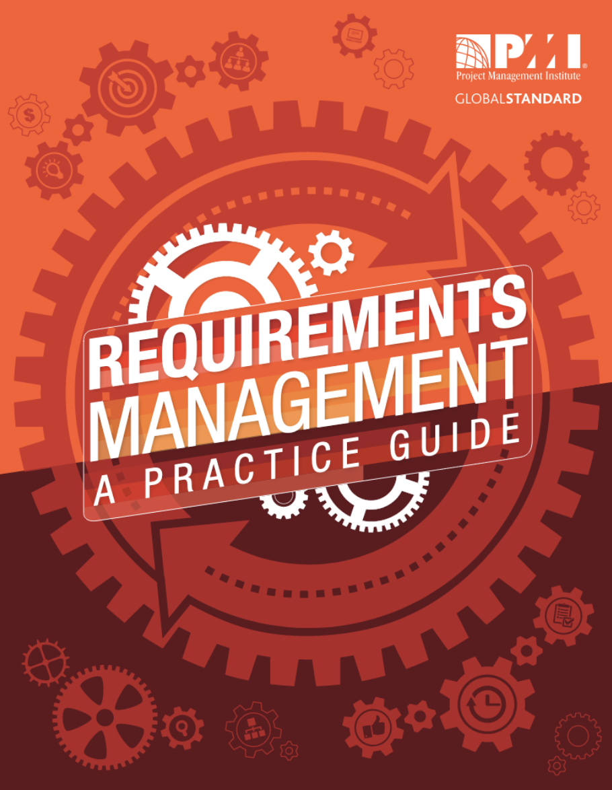
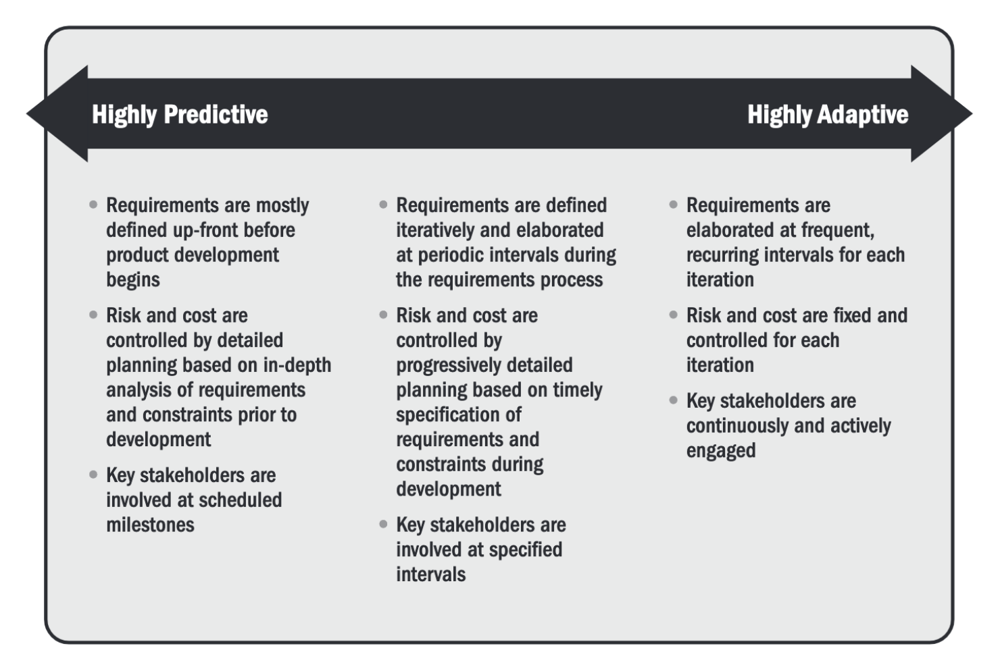

# Ses typologies

*  🔖 **PMI**
*  🔖 **Contexte**

___

## 📑 PMI

Le Project Management Institute, fondé en 1969, est une association professionnelle à but non lucratif qui propose des méthodes de Gestion de projet.

Leur guides et publications constiturons pour nous des ouvrages de référence.

### 🏷️ **Domaines**

Ses fondements reposent sur dix domaines de connaissance :

* L’intégration
* Le contenu
* Les délais
* Les coûts
* La qualité
* Les ressources humaines
* La communication
* Les risques
* Les approvisionnements
* Les parties prenantes (ajout de la version 5)

### 🏷️ **Processus**

La méthodologie PMI propose 49 processus répartis dans les différents domaines de connaissance.

Les processus sont répartis en cinq groupes :

* Démarrage (GD) : 2 processus
* Planification (GP) : 24 processus
* Exécution (GE) : 10 processus
* Suivi et Maîtrise (GSM) : 12 processus
* Clôture (GC) : 1 processus

### 🏷️ **Requirements**

La mise en place des contraintes dépend du positionnement sur les notions d'anticipation et d'adaptation.

___

## 📑 Contexte

Un cachier des charges peut s'appliquer à des produits qui connaissent un contexte différent.

### 🏷️ **Cahier des charges fonctionnel**

Dans le déroulement d'un projet, le cahier des charges fonctionnel précède l'étude technique qui conclut la phase d'avant-projet. Pour arriver au cahier des charges fonctionnel, plusieurs étapes sont donc nécessaires. 
* Étude d'opportunité
* Étude de faisabilité
* Analyse fonctionnelle
* Analyse de la valeur

### 🏷️ **Cadre d'un ERP**

> Un ERP est un progiciel qui permet « de gérer l'ensemble des processus d'une entreprise en intégrant l'ensemble de ses fonctions, dont la gestion des ressources humaines, la gestion comptable et financière, l'aide à la décision, mais aussi la vente, la distribution, l'approvisionnement et le commerce électronique »

La structure d'un cahier des charges pour un ERP est la suivante:

* Présentation de l'entreprise
* Audit du système d'information en place
* Définition des besoins/attentes
* Budget & planning

### 🏷️ **Cadre d'un appel d'offres**

> Dans les marchés publics on parle plutôt des cahiers des charges. 

Les cahiers des charges déterminent les conditions dans lesquelles les marchés sont exécutés.
Ils comprennent des documents généraux et des documents particuliers.

Les documents généraux sont :
* Les cahiers des clauses administratives générales, qui fixent les dispositions administratives applicables à une catégorie de marchés.
* Les cahiers des clauses techniques générales, qui fixent les dispositions techniques applicables à toutes les prestations d’une même nature.

Les documents particuliers sont :

* Les cahiers des clauses administratives particulières, qui fixent les dispositions administratives propres à chaque marché;
* Les cahiers des clauses techniques particulières, qui fixent les dispositions techniques nécessaires à l’exécution des prestations de chaque marché.